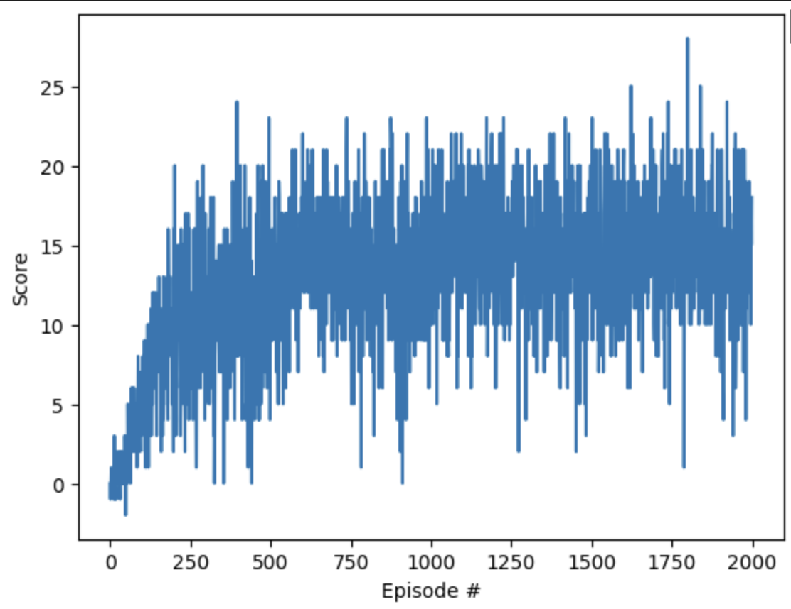

# Deep Q-Learning Algorithm Report

## Learning Algorithm

The project implements a Deep Q-Learning (DQL) algorithm to solve a reinforcement learning task using the Unity ML-Agent environment. The DQL algorithm employs a neural network to approximate the Q-values for a set of discrete actions, enabling the agent to learn an optimal policy through interaction with the environment.

### Neural Network Architecture

The neural network used in this project has the following architecture:
- **Input Layer**: The network receives a 37-dimensional discrete state vector as input.
- **Hidden Layers**: Two fully connected layers, each with 64 features.
- **Output Layer**: A fully connected layer with 4 outputs, corresponding to the Q-values of the 4 discrete actions.

### Hyperparameters

The training of the network is guided by the following hyperparameters:
- **Learning Rate**: `1e-5`
- **Batch Size**: `64`
- **Target Network Soft Update**: `0.99`
- **Reward Discount Factor (γ)**: `0.99`
- **Exploration Discount Factor (ε)**: Decays to a minimum of `0.1`

### Training Details

The agent interacts with the Unity ML-Agent environment, collects experience tuples, and updates the Q-network using a replay buffer. A target network is maintained and updated with a soft update mechanism to stabilize training.

---

## Plot of Rewards

The agent’s performance is evaluated by plotting the rewards obtained per episode. The following criteria are met:
1. The agent achieves an average reward of at least `+13` over the last 100 episodes.
2. The plot clearly illustrates the learning progress and the number of episodes required to solve the environment.

### Results

- **Number of Episodes to Solve**: roughly 500-700 episode
- **Plot of Rewards**: 

---

## Ideas for Future Work

The following improvements can be explored to enhance the agent’s performance:

1. **Network Architecture**:
   - Experiment with deeper or wider network architectures.
   - Incorporate techniques like dropout or batch normalization.

2. **Algorithm Enhancements**:
   - Implement Double Q-Learning to reduce overestimation bias.
   - Add Prioritized Experience Replay to sample important transitions more frequently.

3. **Environment Optimization**:
   - Use domain knowledge to refine the reward function.
   - Introduce more complex scenarios in the Unity ML-Agent environment.

4. **Hyperparameter Tuning**:
   - Perform a systematic search for optimal learning rate, batch size, and discount factors.
   - Explore adaptive learning rates or alternative optimizers such as AdamW.

---

## Conclusion

The Deep Q-Learning algorithm successfully solves the given task in the Unity ML-Agent environment, demonstrating robust learning capabilities. The proposed ideas for future work can further enhance the agent’s efficiency and adaptability in more complex environments.

---

