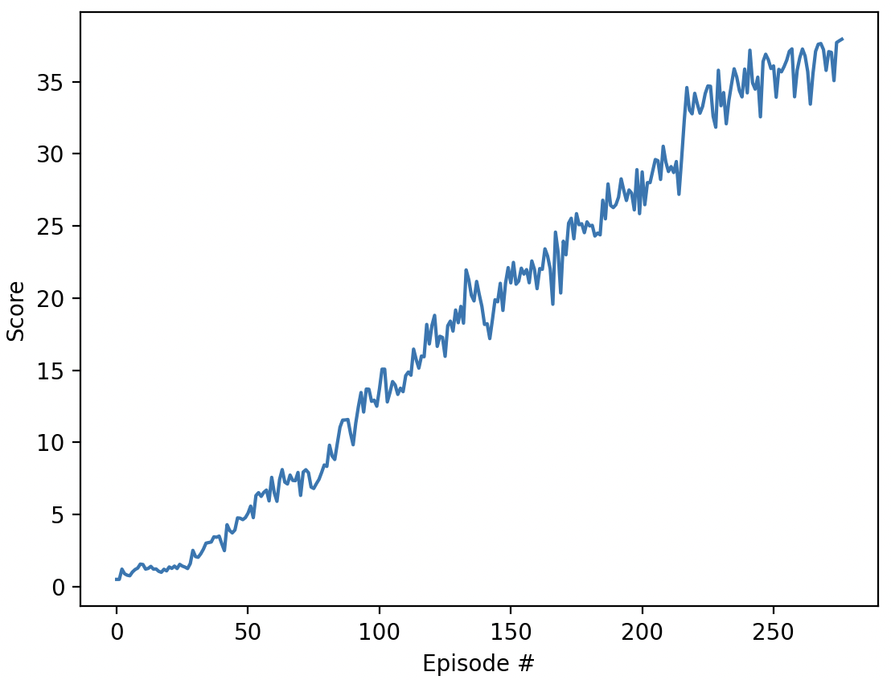

# DDPG Algorithm Report

## Learning Algorithm

The project implemnts the Deep Deterministic Policy Gradient (DDPG) algorithm to solve a reinforcement learning task using the Unity ML-Agent environment. The DDPG is an off-policy, model-free RL algorithm for continuous action spaces, combining DQN and Policy Gradient methods. It uses an actor-critic architecture, where the actor outputs deterministic actions, and the critic evaluates them. Experience replay and target networks improve stability, while noise (e.g., OU noise) enables exploration. The critic is trained using the Bellman equation, and the actor is updated via the policy gradient of Q-values. Soft target updates prevent instability.

### Neural Network Architecture

The neural network used in this project has the following architectures:

**Actor**
- **Input Layer**: The network receives a 33-dimensional discrete state vector as input
- **Hidden Layers** 2 fully connected layers
- **Output Layer** A fully connected layer with 4 outputs representing 4 continuous actions. The output is converted between `[-1, 1]` with `tanh` for continous representation.

**Critic**
- **Input Layers** The network receives a 33-dimensional discrete `state vector`, and a 4-dimensional continous `action vector` as the input. Initially, only the state vector is fed to the first hiddien layer of the network, and the action vector is concatenated to the output of the first hidden layer as the input to the second hidden layer
- **Hidden Layers** 2 fully connected layers
- **Output Layer** A fully connected layer with 1 output that represents the `Q value` of the input `state-action` pair

**Noise**
OU Noise is applied to each action output to ensure exploration

### Hyperparameters

The training of the network is guided by the following hyperparameters:
- **Learning Rate**: `1e-4` for both actor and critic
- **Batch Size**: `128`
- **Target Network Soft Update**: `0.99`
- **Discount Factor**: `0.99`
- **Replay Buffer Size**: `1e6`
- **Mu for OU Noise**: `0.`
- **Theta for OU Noise**: `0.15`
- **Sigma for OU Noise**: `0.2`

### Training Details

The agent interacts with the Unity ML-Agent environment, collects experience tuples. Then it updates both Actor and Critic networks using a replay buffer. Target networks are maintained and updated with a soft update mechanism to stabilize training.

The network is trained with total 20 agents together. The network is updated `10` times for every `20` new experience tuples are added from each agent.

---

## Plot of Rewards

The agent’s performance is evaluated by plotting the rewards obtained per episode. The following criteria are met:
1. The agent achieves an average reward of at least `+30` over the last 100 episodes.
2. The plot clearly illustrates the learning progress and the number of episodes required to solve the environment.

### Results

- **Number of Episodes to Solve**: 60 episodes
- **Plot of Rewards**: 

During the experiment, I also tried training by not adding OU Noise. It significantly reduces the efficiency of learning. In some tests, the network might completely fail to learn. When it learns, the learning speed is much slower as well
- **Plot of Rewards w/o OU Noise**: 

---

## Ideas for Future Work

The following improvements can be explored to enhance the agent’s performance:

1. **Use Soft Actor-Critic (SAC)** – Introduces entropy regularization for better exploration and sample efficiency.

2. **Proximal Policy Optimization (PPO)** - To get more stable training, better exploration, and easier tuning

3. **Prioritized Experience Replay (PER)** – Improve sample efficiency by prioritizing transitions with high TD error.