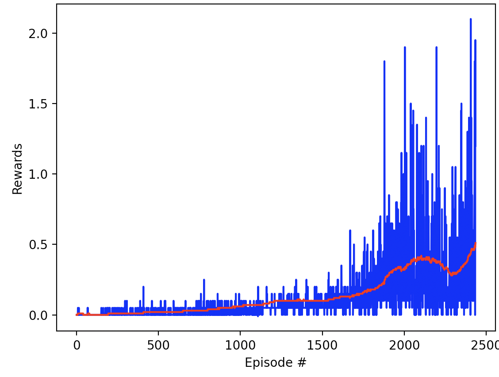
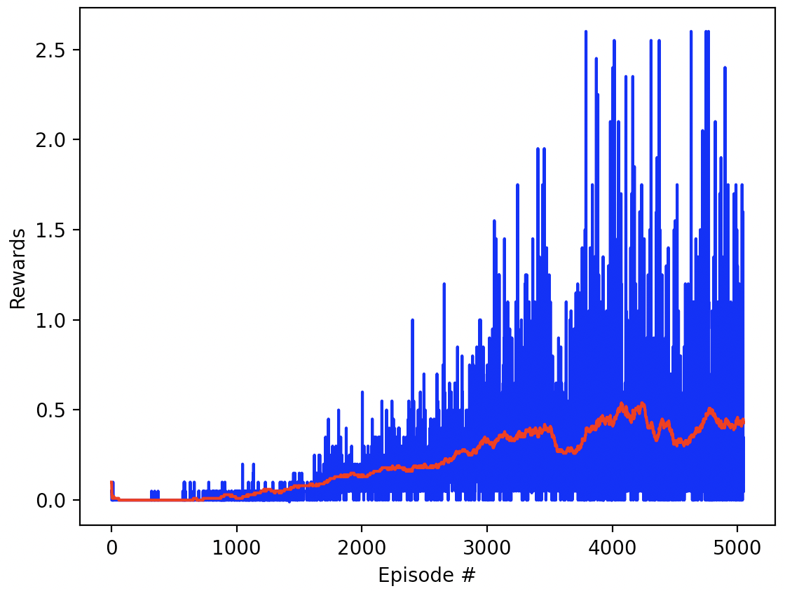
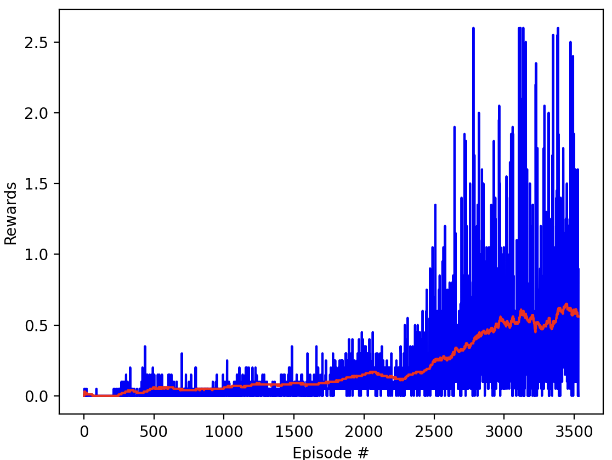
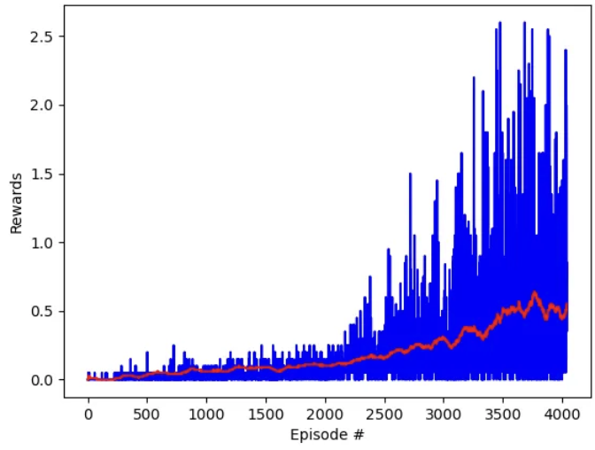
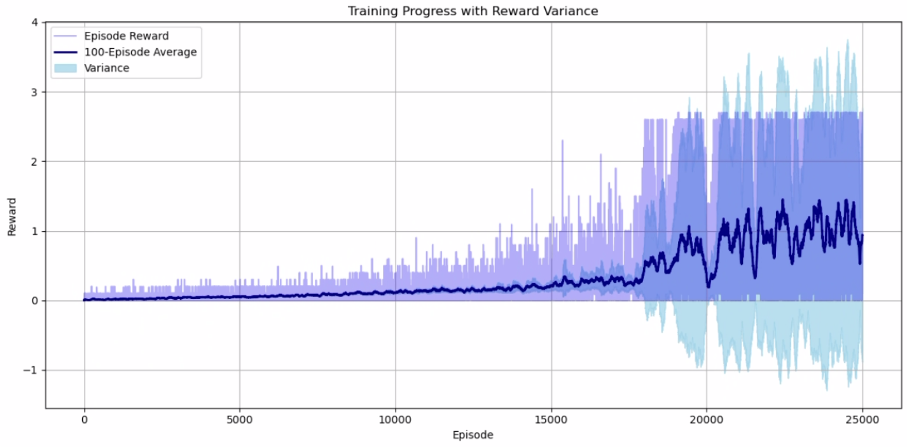
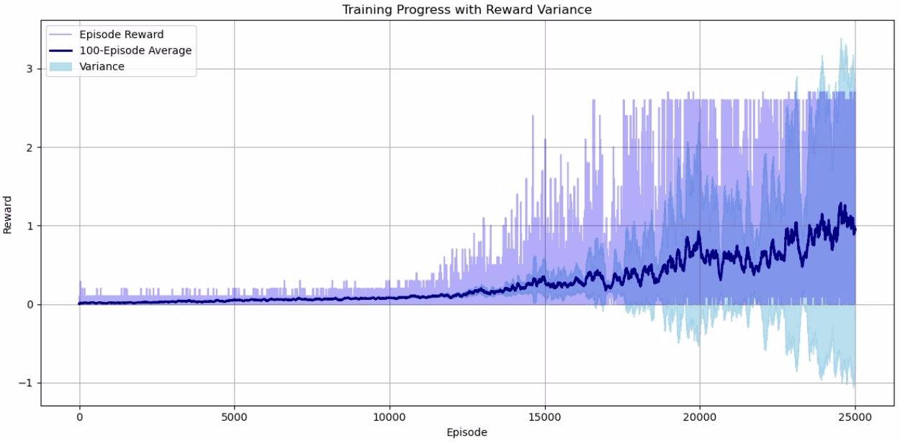
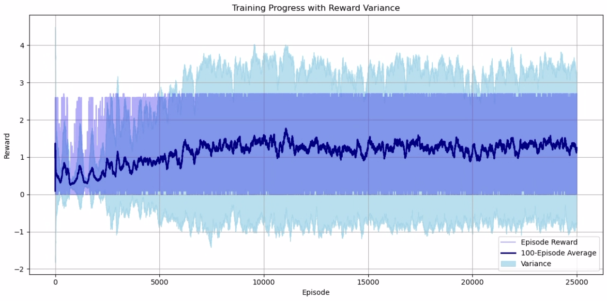

# **Evaluation of Multi-Agent Reinforcement Learning Algorithms for the Unity Tennis Environment**

## **1. Introduction**  
In this project, I explored different reinforcement learning algorithms to solve the Unity ML-Agents **Tennis** environment. The objective was to train two agents to hit a ball back and forth over a net, maximizing cumulative rewards. I experimented with three algorithms:  
- **Deep Deterministic Policy Gradient (DDPG)**  
- **Multi-Agent Deep Deterministic Policy Gradient (MADDPG)**  
- **Multi-Agent Proximal Policy Optimization (MAPPO)**  

The focus was on **training efficiency, stability, and performance improvements** across these approaches.

---

## **2. DDPG Implementation and Results**  
I initially implemented **DDPG**, a model-free, off-policy actor-critic method designed for continuous action spaces. Given the **relatively simple nature** of the Tennis task, DDPG was able to **solve the challenge within approximately 2,500 episodes in the first trial and 5,000 episodes in the second trial**.

However, as shown in **Figure 1 and Figure 2**, training **exhibited frequent performance dips**, and the network **often took a long time to recover** from these fluctuations. This suggests that DDPG, while capable of solving the task, **struggles with stability**.

### **Training Performance of DDPG**  

📌 **Figure 1: DDPG Training Progress (First Trial)**  

📌 **Figure 2: DDPG Training Progress (Second Trial)**  

| Parameter             | Value |
|-----------------------|-------|
| Learning Rate         | 1e-4   |
| Batch Size            | 512   |
| Steps to Update       | 20    |
| Number of Update Each Time       | 20    |
| Discount Factor       | 0.99    |
| Replay Buffer Size       | 1e6    |
| Hidden Layers         | 2     |
| Hidden Layer 1 Size   | 256     |
| Hidden Layers 2 Size  | 128     |
| Activation             | ReLU  |

---

## **3. MADDPG Implementation and Improvements**  
To address DDPG’s instability, I implemented **MADDPG**, which extends DDPG to a multi-agent setting. The **key difference** in MADDPG is the use of **an independent actor-critic pair for each agent**, where:
- During **training**, the **critic receives global observation-action pairs** from all agents, allowing it to learn a **more comprehensive value function**.
- During **testing**, only the **actor** is used, relying solely on each agent’s individual observation, ensuring decentralized execution.

As shown in **Figure 3 and Figure 4**, MADDPG demonstrated **significant improvements in stability compared to DDPG**. While **some fluctuations remained**, the network **recovered faster from performance dips**. This suggests that **sharing global knowledge across agents during training helps stabilize learning**, making MADDPG a more effective solution for multi-agent reinforcement learning.

### **Training Performance of MADDPG**  

📌 **Figure 3: MADDPG Training Progress (First Trial)**  

| Parameter             | Value |
|-----------------------|-------|
| Learning Rate         | 1e-4   |
| Batch Size            | 512   |
| Steps to Update       | 10    |
| Number of Update Each Time       | 10    |
| Discount Factor       | 0.99    |
| Replay Buffer Size       | 1e6    |
| Hidden Layers         | 2     |
| Hidden Layer 1 Size   | 256     |
| Hidden Layers 2 Size  | 128     |
| Activation             | ReLU  |

📌 **Figure 4: MADDPG Training Progress (Second Trial)**  

| Parameter             | Value |
|-----------------------|-------|
| Learning Rate         | 1e-4   |
| Batch Size            | 256   |
| Steps to Update       | 20    |
| Number of Update Each Time       | 20    |
| Discount Factor       | 0.99    |
| Replay Buffer Size       | 1e6    |
| Hidden Layers         | 2     |
| Hidden Layer 1 Size   | 256     |
| Hidden Layers 2 Size  | 128     |
| Activation             | ReLU  |

---

## **4. MAPPO Implementation and Final Results**  
Finally, I tested **Multi-Agent Proximal Policy Optimization (MAPPO)**, an **on-policy** reinforcement learning algorithm. Unlike DDPG and MADDPG, which are **off-policy**, MAPPO has **lower sample efficiency** but is generally **more stable** due to its **clipped policy updates**.

In the **initial MAPPO experiment**, the network achieved **high rewards**, but training exhibited **increased fluctuations** once performance improved. As shown in **Figures 5**, the training curve became **unstable at high rewards**, likely due to **over-aggressive learning steps and excessive exploration**.

### **Training Performance of MAPPO (Before Hyperparameter Tuning)**  

📌 **Figure 5: MAPPO Initial Training Progress with Reward Fluctutations During Late Training**  

| Parameter             | Value |
|-----------------------|-------|
| Learning Rate         | 1e-4   |
| Batch Size            | 256   |
| PPO Echos       | 10    |
| Discount Factor       | 0.99    |
| Hidden Layers         | 2     |
| Hidden Layer 1 Size   | 256     |
| Hidden Layers 2 Size  | 256     |
| Activation             | ReLU  |

To address this issue, I conducted **additional experiments** where I:
- **Gradually reduced the learning rate**.
- **Adjusted entropy regularization dynamically**.
- **Increased PPO epochs for more stable updates**.

After these changes, **MAPPO became significantly more stable**, as seen in **Figures 6**. While this tuning **slightly slowed down training**, the overall performance was **much more reliable** than in the initial trials.

### **Training Performance of MAPPO (After Hyperparameter Tuning)**  

📌 **Figure 6: Final: MAPPO Training with Reduced Learning Rate and PPO Epochs**  

I coutinued training for another 25000 episodes. There are some fluctuation, but overall, the agent is able to maintain high reward without degradation

📌 **Figure 7: Additional 25000 Episode Training**  

---

## **5. Conclusion**  
Through this project, I gained valuable insights into the **trade-offs between off-policy and on-policy reinforcement learning approaches** in a multi-agent setting. The results suggest:
- **DDPG** can solve the task but suffers from **instability**.
- **MADDPG** improves **stability** by leveraging **global agent interactions** during training.
- **MAPPO** provides the most **robust learning behavior**, recovering quickly from fluctuations and maintaining **higher performance stability**.

Overall, **MAPPO emerges as the most suitable method for this task**, balancing **stability and performance**, albeit with a lower sample efficiency compared to off-policy methods.

---

## **6. Future Work**  
To further improve performance, future work could explore:
- **Hybrid training approaches** that combine off-policy efficiency with on-policy stability.
- **Adaptive learning rate schedules** to dynamically adjust learning rates based on training progress.
- **Alternative MARL algorithms** such as **QMIX, ATT-MADDPG, or HAPPO** to compare their performance on the Unity Tennis environment.

